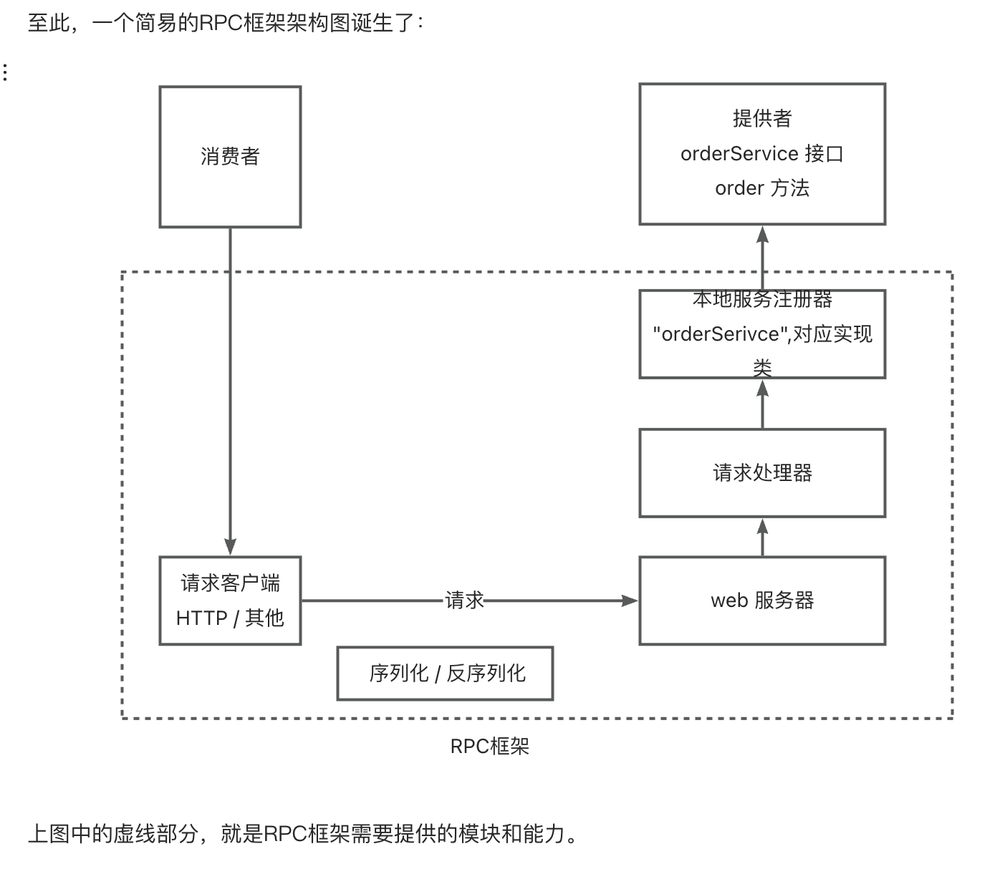

# 莲语 lianyu-rpc 框架

【说明】本项目参考程序员鱼皮 yu-rpc 实现

基于 Java + Etcd + Vert.x 自定义协议实现。 

## 1.简易版 RPC 框架实现

服务提供者在启动时将其服务接口和实现注册到本地服务注册器中。
当服务消费者需要调用远程服务时，它通过请求客户端发送请求，该请求随后被RPC框架接收并序列化。
接着，Web服务器将请求转发给请求处理器，后者调用本地注册的服务实现来执行具体的业务逻辑。
服务执行完毕后，结果被返回给请求处理器，然后经过反序列化处理，最终发送回给消费者，完成整个远程调用过程。

## 2.全局配置加载

在RPC框架运行的过程中，会涉及到很多的配置信息，比如注册中心地址、序列化方式、网络服务端口号等。
在简易版中硬编码了这些配置，不利于维护。而且RPC框架是需要被其他项目作为服务提供者或服务消费者引入的，
我们应当允许引入框架的项目通过编写配置文件来 **自定义配置**。